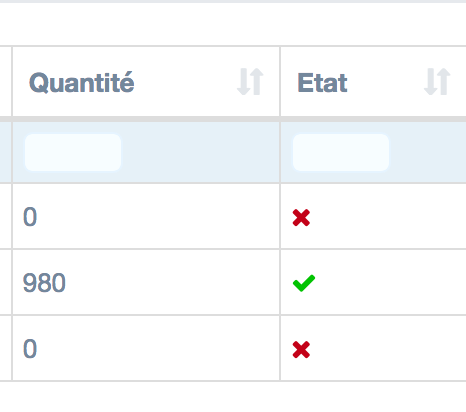

Tips pour morphic
========================
2018-03-13


Rajouter un icône actif/inacf dans une liste
---------------

```php
'colTransformers' => [
    'active' => NullosMorphicHelper::getStandardColTransformer("active"),
],
```



