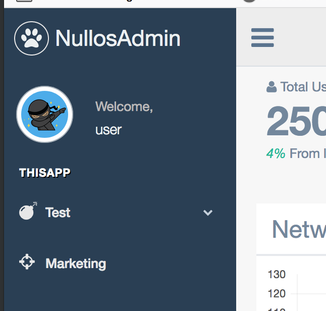

Tutoriel de création d'un backoffice simple avec nullos
==========
2018-03-03 --> 2018-03-06


Aujourd'hui nous allons voir comment créer un backoffice (bo) simple avec le module NullosAdmin.

Pré-requis
----------------
Pour finir ce tutoriel, vous aurez besoin de:

- savoir installer une application kamille


Mise en place du serveur web
--------------------------------


Pour la mise en place du serveur web, je vous laisse faire.
Dans la suite de ce tutoriel mon nom de domaine sera nullos-app (http://nullos-app sera donc l'url du site).


### snippets qui peuvent être utiles si vous utilisez MAMP 

```bash
open /Applications/MAMP/conf/apache/extra/httpd-vhosts.conf
```

Mon virtual host:

```apacheconfig
<VirtualHost *:80>
    ServerAdmin admin@gmail.com
    DocumentRoot "/myphp/nullos-admin-app/www"
    ServerName nullos-app
    SetEnv APPLICATION_ENVIRONMENT dev
    <Directory "/myphp/nullos-admin-app/www">
        AllowOverride All
    </Directory>
</VirtualHost>
```


Installation du module
--------------------------------

Pour commencer, on va créer une application [kamille](https://github.com/lingtalfi/kamille) de base dans un dossier
nullos-app.


```bash
kamille newapp nullos-app
```


Ensuite, pour installer le module:


```bash
kamille install NullosAdmin
```


Le processus de fin d'installation nous avertira de vérifier le fichier de configuration du module Core (config/modules/Core.conf.php).

Faisons-le maintenant: ouvrez le fichier et assurez-vous que les valeurs de configuration suivantes sont bien positionnées: 

- dualSite: true                                    // cela signifie que l'application utilise un front office ET un back office (et non pas juste un front office)
- themeBack: nullosAdmin                            
- themeFront: ApplicationParameters::get("theme")
- defaultProtocol: https                            // ou http si vous n'avez pas https, mais ce n'est pas recommandé
- uriPrefixBackoffice: /admin                       // ici vous pouvez choisir le namespace pour votre back-office  


Quelques concepts de base
--------------------------------

Voici quelques concepts de base utilisés par NullosAdmin.


- le module Core doit être configuré en mode **dualSite**, c'est à dire qu'il doit reconnaître que l'application 
est composée d'un frontoffice ET d'un backoffice.
- les routes de NullosAdmin sont situées dans le fichier **config/routsy/back.php**, qui contient uniquement les routes du backoffice


Ajout d'éléments dans le menu
--------------------------------

Dans cette section, nous allons ajouter 2 éléments au menu gauche de NullosAdmin.

La méthodologie que nous utiliserons sera la suivante:

- création des routes
- création d'une méthode codant les éléments de menu de notre application
- inscription de notre méthode au hook prévu par NullosAdmin


###### Création des routes

Lorsqu'on cliquera sur un élément de menu, l'utilisateur sera redirigeré vers une url.

Dans cette partie, nous définissons quelles urls.

Je commence volontairement par cette partie, car comme ça on n'aura pas de messages d'erreur de routes
non existantes (nous utiliserons nos routes dans la deuxième section juste après).


Ouvrez le fichier de routes du backoffice: **config/routsy/back.php**,
et ajoutez les routes suivantes:

```php
$routes["ThisApp_route_test"] = ["/this_app/test", null, null, "Controller\NullosAdmin\Back\HomePageController:renderClaws"];
$routes["ThisApp_route_marketing"] = ["/this_app/marketing", null, null, "Controller\NullosAdmin\Back\HomePageController:renderClaws"];
```

Note: pour le contrôleur, j'ai réutilisé le même contrôleur que le contrôleur par défaut de NullosAdmin (cela nous évite de créer
un contrôleur nous-même). 


###### Création d'une méthode codant les éléments de menu de notre application


Dans la classe **class-modules/ThisApp/Helper/ThisAppHooksHelper.php**, ajoutez la méthode suivante:

```php

    public static function NullosAdmin_layout_sideBarMenuModelObject(LeeAdminSidebarMenuModel $sideBarMenuModel)
    {


        $section = Section::create()
            ->setName("this_app")
            ->setLabel("ThisApp")
            ->setActive(true);
        $sideBarMenuModel->addSection($section);

        $section
            ->addItem(Item::create()
                ->setActive(true)
                ->setName("test")
                ->setLabel("Test")
                ->setIcon("fa fa-bomb")
                ->setLink("#")
                ->addItem(Item::create()
                    ->setActive(true)
                    ->setName("test")
                    ->setLabel("Test")
                    ->setIcon("fa fa-bomb")
                    ->setLink(A::link("ThisApp_route_test"))
                )
            )
            ->addItem(Item::create()
                ->setActive(true)
                ->setName("marketing")
                ->setLabel("Marketing")
                ->setIcon("fa fa-crosshairs")
                ->setLink(A::link("ThisApp_route_marketing"))
            );
    }

```


> Par habitude, j'utilise un nom de méthode ayant exactement le même nom que le hook auquel elle souscrit. Cependant,
on peut tout à fait utiliser n'importe quel autre nom.

Cette méthode permet de configurer le menu ($sideBarMenuModel).
Ici, on ajoute deux éléments de menu, dont un qui contient un enfant.
 
!> Note, utiliser la classe `<moduleName>/Helper/<moduleName>Helper` est juste une de mes habitudes
personnelles, vous pouvez créer n'importe quelle autre classe si vous voulez, mais assurez-vous de bien être 
dans le module ThisApp, qui est la manière prévue par le framework kamille pour vous laisser interagir avec les modules. 


###### Inscription de notre méthode au hook prévu par NullosAdmin


Pour que NullosAdmin affiche notre menu, on va appeler notre méthode depuis le hook **NullosAdmin_layout_sideBarMenuModelObject**
de NullosAdmin.


Ouvrez le fichier des hooks (**class-core/Services/Hooks.php**) et modifiez la méthode **NullosAdmin_layout_sideBarMenuModelObject**
de manière à ce qu'elle appelle notre méthode:


```php
	protected static function NullosAdmin_layout_sideBarMenuModelObject(\Models\AdminSidebarMenu\Lee\LeeAdminSidebarMenuModel $sideBarMenuModel)
	{
        // mit-start:ThisApp
        ThisAppHooksHelper::NullosAdmin_layout_sideBarMenuModelObject($sideBarMenuModel);
        // mit-end:ThisApp
	}
```


Notez qu'on encadre notre snippet par des commentaires de début et de fin ayant respectivement la syntaxe suivante:

- commentaire de début: `// mit-start:<ModuleName>` 
- commentaire de fin: `// mit-end:<ModuleName>` 

La raison pour laquelle nous faisons cela est pour ne pas que l'installateur de kamille ([kit](https://github.com/lingtalfi/kamille-installer-tool)) écrase notre
code lors de l'installation d'un nouveau module. Car en général, on installe les modules avec kit, **ThisApp**
étant un module particulier que l'on code "à la main".


###### Et voilà, notre menu




Ajout de pages
--------------------------------

Pour ajouter des pages, on utilise exactement la même technique que pour créer des pages dans [kamille](https://github.com/lingtalfi/Kamille).

Donc je vous invite à lire la documentation de kamille pour cette section.


Conclusion
--------------------------------

Voilà, c'est la fin de ce tutoriel.
En général, NullosAdmin est un hôte dans lequel on insère des modules.

Cependant, j'espère que ce petit aperçu permet aux développeurs kamille de comprendre un peu mieux
cette architecture.


