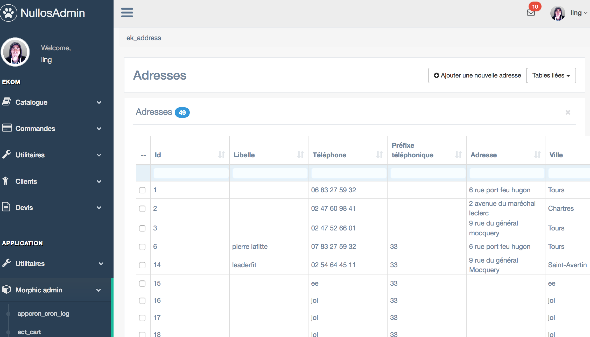
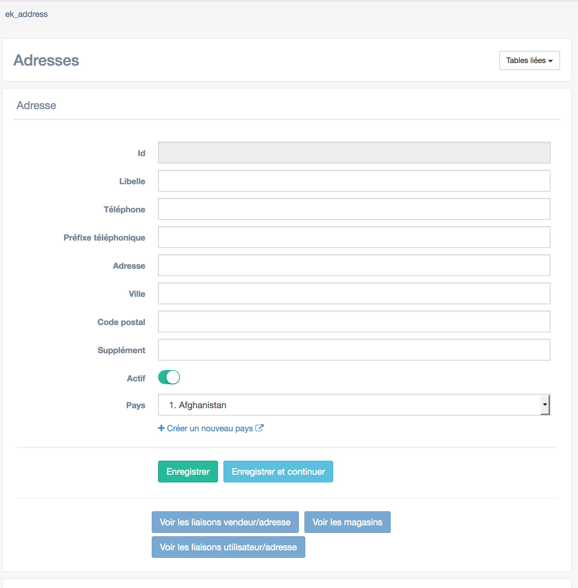

Tutoriel: FormList avec morphic
==========================
2018-04-02


Dans ce tutoriel, nous créons une page FormList à partir d'un élément morphic auto-généré.


Qu'est-ce qu'une page FormList?
--------------------------------

Tout d'abord, à quoi ressemble une page FormList: c'est une page qui est composée d'une liste et d'un formulaire
permettant d'ajouter des éléments à cette liste.

Les deux images ci-dessous montrent les 2 aspects d'une page FormList (la liste, et le formulaire).

Voici à quoi ressemble une liste:





Et voici à quoi ressemble un formulaire (j'espère que je ne vous apprends rien):



A noter qu'en dessous de la partie formulaire, la liste s'affiche en-dessous en plus par défaut (on ne le voit pas sur l'image
mais la liste est bien dessous).


Ces pages FormList sont très pratiques car elles proposent une interface graphique pour visualiser et interagir avec la
base de données.

Il est tout à fait possible de construire un backoffice en utilisant uniquement des pages FormList.

Cependant, pour certaines pages plus complexes, le développeur créera d'autres pages offrant plus de facilités à
l'utilisateur, comme par exemple une page avec une arborescence ou d'autres widgets spéciaux.


Le générateur Morphic
----------------------

Ce qui est pratique, c'est que le [générateur Morphic](http://www.ling-docs.ovh/kamille/#/tools/morphic?id=le-g%c3%a9n%c3%a9rateur) permet de générer automatiquement toutes les pages FormList
d'une base de données.

Je vous invite à lire la doc de ce générateur pour plus d'infos sur comment l'utiliser.


Notre stratégie pour créer des pages FormList
----------------------

Notre stratégie pour créer des pages FormList simples va donc être la suivante:

- utiliser un élément morphic auto-généré (on gagne ainsi beaucoup de temps)
- customiser cet élément dans les détails de manière à avoir exactement la page FormList que l'on souhaite


Pour ce faire, nous allons commencer par générer les élément morphic en mode multi-modules, de manière
à ce que le générateur morphic créé les contrôleurs pour notre module.

> Le générateur morphic a deux modes possibles:
- le mode par défaut, qui génère les éléments au sein du module ApplicationMorphicGenerator (qui est le module officiel du générateur)
- le mode multi-modules, qui génère les éléments par module (en se basant sur les préfixes de la base de données).


Pour générer les éléments morphic, tapez la commande suivante (je passe les détails d'installation du générateur, vous trouverez la documentation ailleurs):

```bash
cd /path/to/my_app
morphic -m
```

Cette commande génère les éléments morphic constitués de:

- un contrôleur situé dans le dossier `class-controllers/$ModuleName/Back/Generated`
- un fichier de configuration de liste, situé dans `config/morphic/$ModuleName/generated`, et dont le nom termine par l'extension `list.conf.php`
- un fichier de configuration de formulaire, situé dans `config/morphic/$ModuleName/generated`, et dont le nom termine par l'extension `form.conf.php`
- un fichier contenant les routes vers les pages FormList générées, situé dans `store/$ModuleName/Morphic/morphic-generated-routes.php`
- un fichier contenant les éléments du menu gauche (de Nullos) et pointant vers les pages FormList générées, situé dans `store/$ModuleName/Morphic/morphic-generated-menu.php`


Appliquons maintenant notre stratégie; celle-ci sera constituée des étapes suivantes:

- créer une page
- rappatrier les fichiers générés dans le dossier de notre module
- configurer les fichiers de configuration de la liste et du formulaire


Etape 1: Créer une page
---------------------

La création d'une page dans Nullos est composée des étapes suivantes:

- déclaration d'une route dans le fichier `config/routsy/back.php`
- création d'un accès dans le menu gauche
- création d'un contrôleur de base

!> Si vous voulez gagner un peu de temps, la commande kamille newpage peut s'occuper de l'étape 1 et 3 pour vous en une ligne de commande.
Plus d'informations dans la documentation de [kit](http://www.ling-docs.ovh/kamille/#/tools/kit?id=cr%c3%a9er-une-page).
Ici cependant, nous ferons toutes les étapes à la main de manière à ce que vous puissez comprendre le mécanisme de base.


###### Déclaration de la route

Ouvrez le fichier `config/routsy/back.php` et ajoutez votre route:

```php
$routes["Ekom_Users_Address_List"] = ["/ekom/users/address/list", null, null, 'Controller\Ekom\Back\Users\AddressListController:render'];
```

> Note: les paramètres que j'utilise ici sont donnés à titre d'exemple, vous pouvez changer tous les paramètres comme
bon vous semble, il n'y a pas de convention de nommage particulière à respecter.


###### Création d'un élément dans le menu de gauche

Pour ajouter un élément dans le menu de gauche, nous allons utiliser le hook `NullosAdmin_layout_sideBarMenuModelObject`.

La solution la plus simple que j'ai trouvée pour l'instant est de créer une classe helper qui servira à implémenter tous les hooks
auxquels notre module s'abonne.

Créez un fichier `class-modules/{ModuleName}/Helper/{ModuleName}BackHooksHelper` et copiez le contenu suivant dedans (adaptez par rapport
à votre module):

```php
<?php


namespace Module\FishMailer\Helper;


use Models\AdminSidebarMenu\Lee\LeeAdminSidebarMenuModel;
use Models\AdminSidebarMenu\Lee\Objects\Item;
use Models\AdminSidebarMenu\Lee\Objects\Section;
use Core\Services\A;


class FishMailerBackHooksHelper
{

    public static function NullosAdmin_layout_sideBarMenuModelObject(LeeAdminSidebarMenuModel $sideBarMenuModel)
    {

        $section = Section::create()
            ->setName("fish_mailer")
            ->setLabel("FishMailer")
            ->setActive(true);
        $sideBarMenuModel->addSection($section);


        $section
            //--------------------------------------------
            // UTILS
            //--------------------------------------------
            ->addItem(Item::create()
                ->setActive(true)
                ->setName("FishMailer.templateViewer")
                ->setLabel("TemplateViewer")
                ->setIcon("fa fa-file-picture-o")
                ->setLink(A::link("FishMailer_TemplateViewer"))
            );
    }

}
```

Ce code va permettre de créer la section pour votre module (ici le module est FishMailer).


Maintenant, il faut enregistrer cette méthode dans le hook.

Ouvrez le fichier `class-core/Services/Hooks.php`, cherchez la méthode `NullosAdmin_layout_sideBarMenuModelObject`
et faîtes en sorte qu'elle ressemble à ceci (faîtes bien attention à conserver le code existant):


```php
    protected static function NullosAdmin_layout_sideBarMenuModelObject(\Models\AdminSidebarMenu\Lee\LeeAdminSidebarMenuModel $sideBarMenuModel)
    {
        //...some other code, don't remove it

        // mit-start:FishMailer
        \Module\FishMailer\Helper\FishMailerBackHooksHelper::NullosAdmin_layout_sideBarMenuModelObject($sideBarMenuModel);
        // mit-end:FishMailer
    }

```

Ca y est, maintenant notre hook est bien enregistré et notre menu apparaîtra dans le menu de gauche de nullos.


> Dans le cadre de notre tutoriel, la route à utiliser au sein de notre helper est bien évidemment celle que l'on a indiquée
dans le fichier `config/routsy/back.php`, soit `Ekom_Users_Address_List` dans notre exemple.


###### Création du contrôleur

Créez le fichier `class-controllers/Ekom/Back/Users/AddressListController` (tel qu'indiqué dans le fichier `config/routsy/back`) et copiez-y le code suivant:

```php
<?php


namespace Controller\Ekom\Back\Users;

use Controller\Ekom\Back\Generated\EkAddress\EkAddressListController;

class AddressListController extends EkAddressListController
{
    public function __construct()
    {
        parent::__construct();
        $this->addConfigValues([
            'title' => "Adresses",
            'route' => "Ekom_Users_Address_List",
            'form' => "back/users/address",
            'list' => "back/users/address",
        ]);

    }
}


```

Il y a deux choses importantes à noter ici:

- l'astuce principale est que notre contrôleur hérite d'un contrôleur auto-généré par morphic avec l'option -m.
    Cela signifie que par défaut, si on enlevait le constructeur, on aurait exactement la page FormList telle
    que générée par le générateur morphic.
    Cependant, nous souhaitons aller plus loin et nous donner la possibilité de modifier cette configuration
    (comme le nom des colonnes par exemple, et bien d'autres choses), c'est pourquoi nous allons
    copier les fichiers de configuration de liste et formulaire dans notre.
- les fichiers de configuration de liste et formulaire sont indiqués ici grâce aux propriétés form et list.
    Ici, nous indiquons la destination dans laquelle nous souhaitons les mettre, et on les copiera juste après.
    Les fichiers correspondant aux identifiants indiqués sont préfixé de: `config/$ModuleName`


Etape 2: rappatrier les fichiers générés dans le dossier de notre module
-----------------------


Copiez les fichiers générés `config/morphic/Ekom/generated/ek_address.form.conf.php` et `config/morphic/Ekom/generated/ek_address.list.conf.php`
ici `config/morphic/Ekom/back/users/address.form.conf.php` et là `config/morphic/Ekom/back/users/address.list.conf.php`

Tant que nous sommes dans les fichiers de configuration, il faut que l'on règle un petit souci tout de suite:
ouvrez le fichier de configuration de liste (`config/morphic/Ekom/back/users/address.list.conf.php`) et
cherchez la ligne contenant `formRoute`.

Remplacez la ligne générée par votre propre route:

```php
'formRoute' => "Ekom_Users_Address_List",
```

Cette modification permet de bien rediriger vers le formulaire de notre contrôleur
(et non pas le contrôleur auto-généré) lorsque l'utilisateur modifie un élément de la liste.


Etape 3: Customisation des fichiers de configuration
--------------------------

Et enfin, la partie la plus marrante, configurez les fichiers de configuration comme vous le souhaitez.
Pour apprendre à configurer vos éléments morphic, je vous invite à consulter la [documentation officielle](http://www.ling-docs.ovh/kamille/#/tools/morphic?id=fichier-de-configuration-formulaire)
sur ce sujet. Bonne lecture.


