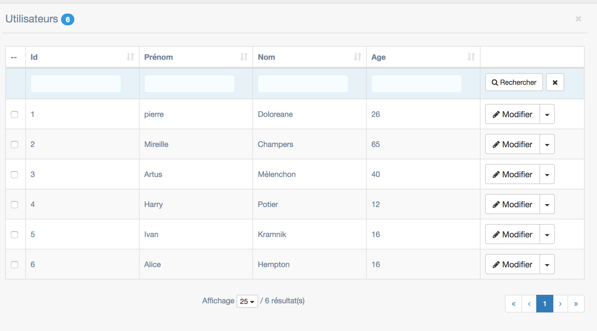

Tutoriel liste morphic
==========================
2018-03-13


Dans ce tutoriel, nous essayons d'exposer une liste morphic dans son état le plus simple.


Créer une route et le contrôleur correspondant avec le code suivant (nous utilisons [Claws](http://www.ling-docs.ovh/kamille/#/tools/claws) dans cet exemple): 


Contrôleur
----------------
```php


<?php

namespace Controller\YourModule\Misc;


use Controller\NullosAdmin\NullosBaseController;
use Kamille\Utils\Claws\ClawsWidget;

class MyTestController extends NullosBaseController
{
    public function render(){
        $this->prepareClaws();
        $this->getClaws()->setWidget("maincontent.mywidget", ClawsWidget::create()
            ->setTemplate("Test/mytemplate") // theme/nullosAdmin/widgets/Test/mytemplate.tpl.php
            ->setConf([])
        );

        return parent::doRenderClaws();
    }
}
```


Template
--------------

Dans le template (`theme/nullosAdmin/widgets/Test/mytemplate.tpl.php`), placez le code suivant.

```php
<?php


use Core\Services\A;
use Module\NullosAdmin\Morphic\Renderer\NullosMorphicAdminListRenderer;


$viewId = "hello";
$module = "Test";
$context = [];
$params = [];
$config = A::getMorphicListConfig($module, $viewId, $context);


?>

<div id="morphic-container">
    <?php echo NullosMorphicAdminListRenderer::create()->renderByConfig($config, $params); ?>
</div>

<script>
    jqueryComponent.ready(function () {
        var jElement = $('#morphic-container');
        var o = new window.Morphic({
            'element': jElement
        });
    });
</script>


```

!> Normalement, dans une application MVC, l'appel à `A::getMorphicListConfig` serait fait plutôt
du côté contrôleur ou model, mais pour simplifier l'exemple nous mettons tout dans la view.


Fichier de configuration
---------------------

Il nous reste maintenant à créer un fichier de configuration de liste morphic.
Rappelons que les fichiers de configuration des listes morphic nécessitent une table dans une base de données.

Voici le dump de la table que je vais utiliser pour cet exemple:

```sql
CREATE TABLE `tmp_users` (
  `id` int(11) NOT NULL,
  `first_name` varchar(256) NOT NULL,
  `last_name` varchar(256) NOT NULL,
  `age` int(11) NOT NULL
) ENGINE=InnoDB DEFAULT CHARSET=utf8;


INSERT INTO `tmp_users` (`id`, `first_name`, `last_name`, `age`) VALUES
(1, 'pierre', 'Doloreane', 26),
(2, 'Mireille', 'Champers', 65),
(3, 'Artus', 'Mélenchon', 40),
(4, 'Harry', 'Potier', 12),
(5, 'Ivan', 'Kramnik', 16),
(6, 'Alice', 'Hempton', 16);
```


Maintenant, le fichier de configuration, situé ici: `config/morphic/Test/hello.list.conf.php`.

Le contenu est le suivant:


```php
<?php


$q = "select %s 
from tmp_users   
";


$conf = [
    //--------------------------------------------
    // LIST WIDGET
    //--------------------------------------------
    'title' => "Utilisateurs",
    'table' => 'tmp_users',
    /**
     * This is actually the list.conf identifier
     */
    'viewId' => 'hello',
    "headers" => [
        'id' => 'Id',
        'first_name' => 'Prénom',
        'last_name' => 'Nom',
        'age' => 'Age',
        '_action' => '',
    ],
    'querySkeleton' => $q,
    "queryCols" => [
        'id',
        'first_name',
        'last_name',
        'age',
    ],
    "ric" => [
        'id',
    ],
    'rowActions' => [
        [
            'name' => 'update',
            'label' => 'Modifier',
            'icon' => 'fa fa-pencil',
            'link' => function(array $row){
                return '/link-to-the-update-form';
            },
        ],
        [
            'name' => 'delete',
            'label' => 'Supprimer',
            'icon' => 'fa fa-close',
            'confirm' => "Êtes-vous sûr(e) de vouloir supprimer cette ligne ?",
            'confirmTitle' => "Attention",
            'confirmOkBtn' => "Ok",
            'confirmCancelBtn' => "Annuler",

        ],
    ],
    'context' => $context,
];


```


Résultat
------------


Et le résultat visuel:



  
  
Aller plus loin
------------------

Pour plus d'informations, veuillez consulter la [documentation de morphic de kamille](http://www.ling-docs.ovh/kamille/#/tools/morphic)  